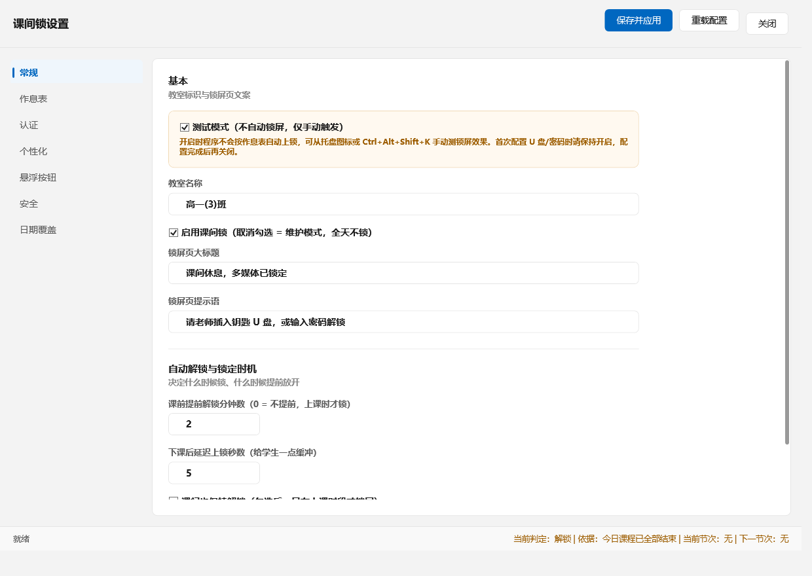

# 教室多媒体课间锁 (ClassroomBreakLock)

一个给学校**教室多媒体机**（讲台电脑）用的课间锁屏程序。

**上课时段自动锁屏，课间和课前自动放开**；老师用 U 盘、密码或手机动态码解锁。

- 技术栈：**WPF (.NET 8)**，单文件桌面程序，**无任何第三方依赖**
- 纯本地运行：不联网、不上报、不收集任何数据
- 提供本地 HTTP 接口，可被 ClassIsland 等课表软件驱动

---

## 特性一览

| 功能 | 说明 |
|---|---|
| **按作息表自动锁屏** | 按星期 + 节次时间表判定，上课锁、课间放 |
| **课前提前解锁** | 全局可设，也能对单个节次单独覆盖 |
| **U 盘认证** | 卷序列号 + 密钥文件哈希**双重绑定**同一把盘，文件拷到别的盘无效 |
| **密码认证** | PBKDF2-SHA256，12 万次迭代，随机盐，不存明文 |
| **动态码认证** | 标准 RFC 6238 TOTP，与主流验证器互通 |
| **应急码** | 一次性兜底码，用完即废并留痕 |
| **右下角「下课」按钮** | 老师主动上锁；带二次确认与误触保护；可拖动、可吸附、可淡出 |
| **多显示器** | 逐屏 DPI 换算，可指定按钮出现在哪块屏 |
| **强置顶** | 每 200ms 重申 Z 序，前台被抢就夺回 |
| **防退出看门狗** | 主进程被杀后自动重启 |
| **审计日志** | 按天分文件，谁在何时用什么方式解锁全部留痕 |
| **日期覆盖** | 放假 / 调休不用改作息表本体 |
| **锁屏个性化** | 可换背景图，带遮罩、模糊、不透明度调节 |
| **ClassIsland 同步** | 本地 HTTP 端口接收上课/下课事件 |
| **防自锁保护** | 零认证时拦截所有上锁入口，避免把自己关在门外 |

---

## 快速开始

### 环境

- Windows 10 1903+ / Windows 11
- [.NET 8 Desktop Runtime](https://dotnet.microsoft.com/download/dotnet/8.0)

### 运行

```powershell
cd src\ClassroomBreakLock
dotnet run
```

### 首次运行不会自动锁屏

这是**刻意的设计**。

默认配置里一个认证方式都没配。如果一启动就按作息表把屏幕锁上，你会被关在外面、**连设置都进不去**（先有鸡还是先有蛋）。

> ⚠️ **正式部署前必须去设置里取消勾选「测试模式」**，否则课间根本不会自动锁。

正确顺序：

```
启动 → 双击托盘图标进设置 → 配好认证方式 → 确认作息表 → 取消「测试模式」→ 保存
```

想快速回到不锁的状态：删掉 `C:\ProgramData\ClassroomBreakLock\config.json` 重启。

**完整的操作步骤见 [docs/使用手册.md](docs/使用手册.md)。**

---

## 文档

| 文档 | 内容 |
|---|---|
| **[docs/使用手册.md](docs/使用手册.md)** | 面向部署人员和老师的完整手册：配置、作息表、导入课表、ClassIsland 对接、部署、排错 |
| [docs/DESIGN.md](docs/DESIGN.md) | 设计风格约定 —— **改界面前先读这个** |

---

## 项目结构

```
ClassroomBreakLock/
├── docs/
│   ├── 使用手册.md            完整使用文档
│   └── DESIGN.md              设计风格约定
├── preview/                   界面预览图
├── src/ClassroomBreakLock/
│   ├── Program.cs             入口（含 --watchdog 分流）
│   ├── AppHost.cs             编排层：调度 / 锁屏 / 托盘 / 看门狗 / 认证门
│   ├── app.manifest           执行级别声明（提权开关在这里）
│   ├── Assets/app.ico         应用图标
│   ├── Config/
│   │   ├── AppConfig.cs       主配置 + 默认作息
│   │   ├── AuthConfig.cs      U 盘 / 密码 / TOTP / 应急码
│   │   ├── Schedule.cs        节次、周表、日期覆盖
│   │   ├── ScheduleImporter.cs 作息表导入（YAML / Excel / CSV / TXT）
│   │   ├── AppearanceAssets.cs 锁屏背景图资源
│   │   ├── DailyQuote.cs      每日一言
│   │   └── ConfigStore.cs     读写 + 原子写 + 配置迁移
│   ├── Scheduling/ScheduleEngine.cs  作息判定引擎
│   ├── Auth/
│   │   ├── UsbAuthService.cs  U 盘 SN + 密钥文件双重校验
│   │   ├── Totp.cs            RFC 6238
│   │   ├── HashUtil.cs        PBKDF2
│   │   └── AuthService.cs     统一认证门面 + 审计
│   ├── Interop/
│   │   ├── NativeMethods.cs   Win32 P/Invoke
│   │   ├── TopMostLock.cs     置顶 + 热键屏蔽
│   │   ├── MonitorService.cs  多显示器枚举与定位（含 DPI 换算）
│   │   ├── WindowEffects.cs   窗口特效
│   │   └── FluentMenuRenderer.cs  托盘菜单自绘
│   ├── Sync/ClassIslandBridge.cs  本地 HTTP 状态接收
│   ├── Theme/
│   │   ├── CI.Tokens.xaml     设计令牌（颜色 / 圆角 / 字体）
│   │   ├── CI.Settings.xaml   设置页样式
│   │   └── CI.Lock.xaml       锁屏页样式
│   ├── Views/
│   │   ├── LockWindow.xaml    锁屏界面（4 种认证）
│   │   ├── SettingsWindow.xaml 设置界面（左侧导航 + 卡片）
│   │   ├── SettingsAuthGate.cs 进入设置的认证门
│   │   ├── FloatingButtonWindow.xaml  右下角「下课」按钮
│   │   └── AppDialog.cs       自绘圆角弹窗（替代系统 MessageBox）
│   └── Logging/Log.cs         审计日志
└── tools/
    ├── Verify/                校验工程
    └── ThemePreview/          离线渲染预览图
```

---

## 校验

```powershell
cd tools\Verify
dotnet run
```

校验工程**直接引用主程序源码**编译（不是复制粘贴），所以验证的就是实际运行的那份逻辑。

覆盖内容：

```
✓ TOTP RFC 6238 官方测试向量 6/6
✓ Base32 编解码往返 5/5
✓ TOTP 漂移容忍与拒绝逻辑
✓ PBKDF2 正误判 / 大小写敏感 / 盐随机性
✓ 作息表引擎 15 个边界场景
  （07:00 不锁 / 08:10 锁 / 08:53:30 课前解锁 / 08:45:03 缓冲期不锁
   / 08:45:10 缓冲期后锁 / 午休不锁 / 22:00 不锁 / 周日不锁
   / 日期覆盖放假 / 节次级提前覆盖 / 总开关 / 课间策略）
✓ GetCurrentPeriod 15 个判定场景（含左闭右开边界）
✓ 悬浮按钮几何 27 项（吸附阈值 / 工作区夹取 / 负坐标副屏 / 显示器回落）
✓ 窗口可见性、吸附交互、每日一言、个性化配置
```

### 重新生成预览图

```powershell
cd tools\ThemePreview
dotnet run -- ..\..\preview
```

会把锁屏页、设置页各标签页渲染成 PNG 到 `preview/`，便于验收视觉改动。

---

## 界面预览

| 锁屏页 | 设置页 | 悬浮按钮 |
|---|---|---|
|  |  |  |

---

## 部署要点

三条最重要的：

1. **关掉测试模式**（设置 → 常规 → 取消勾选）—— 否则课间永远不自动锁
2. **要压住管理员权限的程序**，需把 `app.manifest` 的 `requestedExecutionLevel` 从 `asInvoker` 改成 `requireAdministrator`（代价：每次启动弹 UAC）
3. **开机自启用任务计划程序**，勾选「使用最高权限运行」

详细步骤见 [docs/使用手册.md](docs/使用手册.md) 第九节。

---

## 设计上的两个刻意取舍

这两条是有意为之，**不是缺陷**：

1. **首次运行默认「测试模式」** —— 默认零认证，一出厂就自动锁会把配置者关在门外。
2. **`app.manifest` 默认 `asInvoker`** —— 便于直接双击测试；要压住管理员程序需自行改成 `requireAdministrator`。

---

## 已知限制

- `Ctrl+Alt+Del` 是 Windows 安全序列，**无法用键盘钩子屏蔽**（学生按了会看到锁屏，但没凭据进不去桌面）
- 这类方案的定位是**「防随手乱动」，不是「防恶意破解」**——知道管理员密码就拦不住
- 卷序列号会被**格式化**改变，格式化 U 盘后需重新登记
- 时间判定依赖系统时钟，建议用组策略禁止普通用户改时间
- 截屏保护需要 Win10 2004+，更低版本自动降级

---

## 许可

[MIT](LICENSE)
